# 🔐 On-Premise Active Directory Home Lab

## 📋 Objective

To simulate a **corporate network environment** by configuring a **Windows Server 2022 Domain Controller** and managing enterprise user accounts. This project demonstrates proficiency with **Active Directory Domain Services (AD DS)**, **DHCP/DNS configuration**, **PowerShell scripting**, and **Group Policy Management**.

---

## 🛠️ Tools & Technologies Used

- **VirtualBox** - Hypervisor for virtual machine management
- **Windows Server 2022 ISO** - Domain Controller operating system
- **Windows 10 ISO** - Client machine for testing
- **PowerShell** - Bulk user creation and automation scripts
- **Active Directory Domain Services (AD DS)** - User and computer management
- **DHCP/DNS** - Network services configuration
- **Group Policy Management** - Security policies and configurations

---

## 🔧 Key Skills Demonstrated

- ✅ **Active Directory Domain Services (AD DS) Installation & Configuration**
- ✅ **Domain Controller Promotion**
- ✅ **DHCP & DNS Configuration**
- ✅ **Bulk User Creation via PowerShell Scripting**
- ✅ **Organizational Units (OUs) & Group Policy Objects (GPOs)**
- ✅ **User Account Management & Permissions**
- ✅ **Network Topology Design & Implementation**

---

## 📊 Network Diagram

```
┌─────────────────────────────────────────┐
│   Virtual Network (172.16.0.0/24)       │
├─────────────────────────────────────────┤
│                                         │
│  ┌──────────────────┐                   │
│  │   DC01           │                   │
│  │ Windows Server   │                   │
│  │      2022        │                   │
│  │ 172.16.0.1       │                   │
│  │ mylab.local      │                   │
│  └──────────────────┘                   │
│           │                             │
│           ├─ AD DS                      │
│           ├─ DNS                        │
│           └─ DHCP                       │
│           │                             │
│  ┌────────┴──────────┐                  │
│  │                   │                  │
│  ▼                   ▼                  │
│ CLIENT1            CLIENT2              │
│ (Windows 10)       (Windows 10)         │
│                                         │
└─────────────────────────────────────────┘
```

---

## 🚀 Implementation Steps

## Phase 1: Infrastructure Setup
This phase focuses on provisioning the underlying hardware and operating system required to host the Active Directory environment.

### Step :one:: Resource Calibration
**Action:** Provisioned a virtual machine with 4GB of RAM and 2 CPUs to ensure host system stability during the lab.
* **Evidence:**

  
    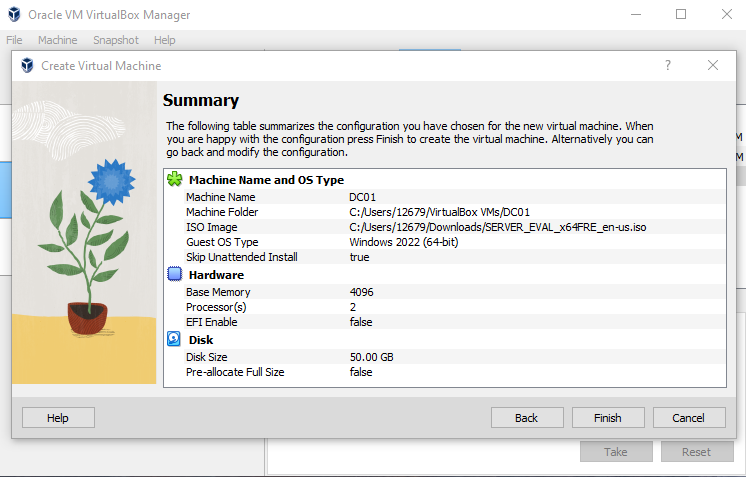
  

### Step :two:: OS Selection (Part 1)
**Action:** Selected the Windows Server 2022 Evaluation ISO as the foundation for the Domain Controller.
* **Evidence:**

  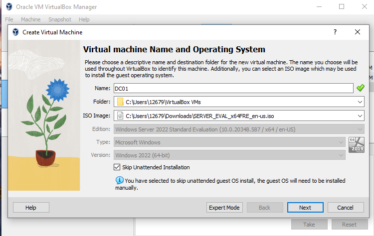

### Step :three:: OS Selection (Part 2)
**Action:** Ensured the "Desktop Experience" version was installed to allow for GUI-based management of Active Directory.
* **Evidence:**

  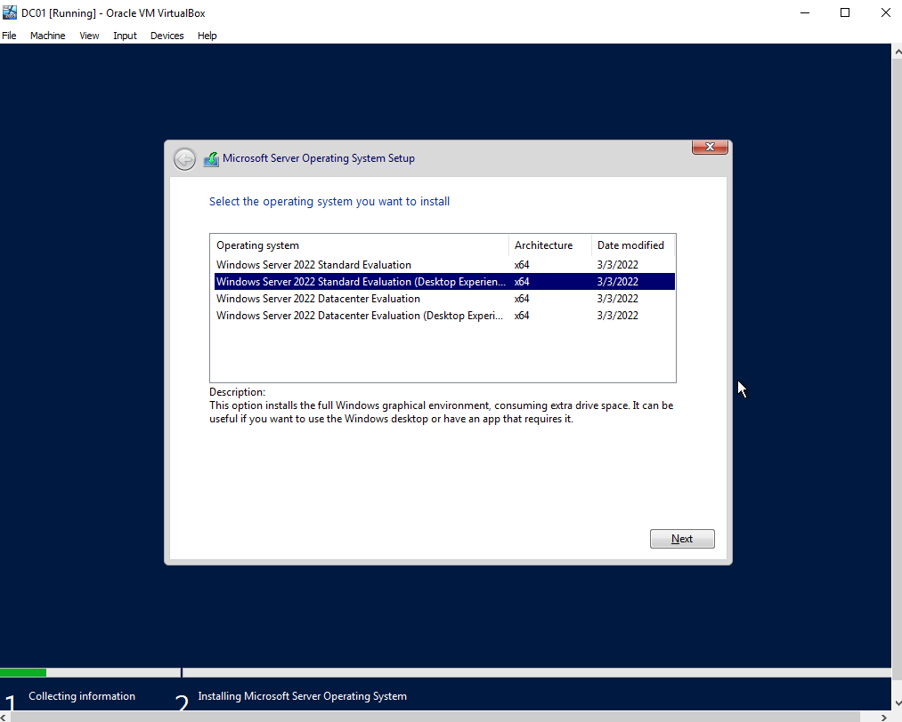

### Step :four:: Initial Deployment
**Action:** Performed the initial OS installation and verified the first successful Administrator login to the desktop environment.
* **Evidence:**
  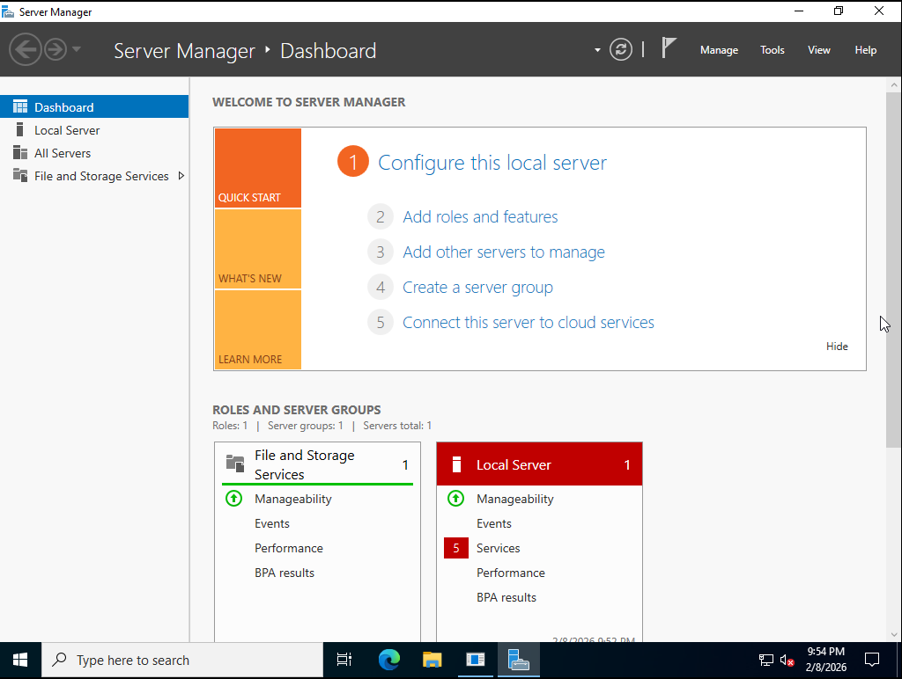

### Step :five:: Standardized Naming
**Action:** Implemented corporate naming standards by renaming the server to **DC01** to make it easily identifiable on the network.
* **Evidence:**
 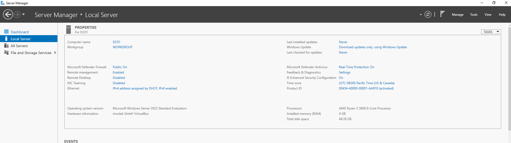

### Step :six:: Static Network Identity
**Action:** Configured a static IPv4 address for the Domain Controller to ensure a consistent network identity.
* **Configuration:** Assigned `172.16.0.1` with a `255.255.0.0` subnet mask to match the network topology.
* **Evidence:**
  
   

### Step :seven:: Domain Verification
**Action:** Promoted the server to a Domain Controller and confirmed the successful creation of the `mylab.local` forest.
* **Evidence:**
 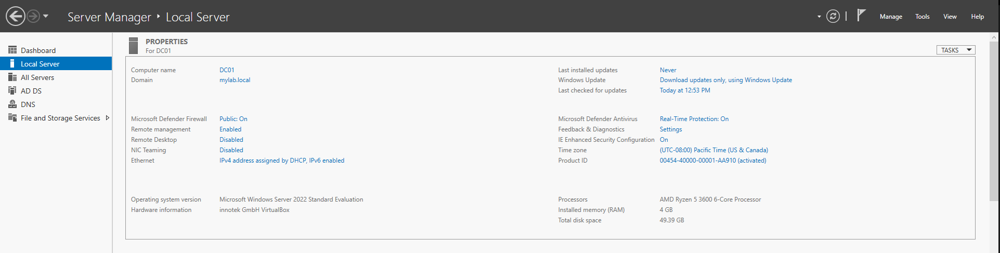

---

## Phase 2: Network Multi-Homing & PowerShell Automation
This phase establishes the communication bridge between the isolated lab and the external world while leveraging automation to scale the environment.

### Step :one:: Network Multi-Homing (Dual NICs)
**Action:** Configured dual Network Interface Cards (NICs). One adapter is set to NAT for external updates, while the other is set to an Internal Network for isolated lab communication.
* **Evidence:** 

### Step :two:: Administrative Environment Prep
**Action:** Launched the PowerShell Integrated Scripting Environment (ISE) as an Administrator to begin the automation workflow.
* **Evidence:** 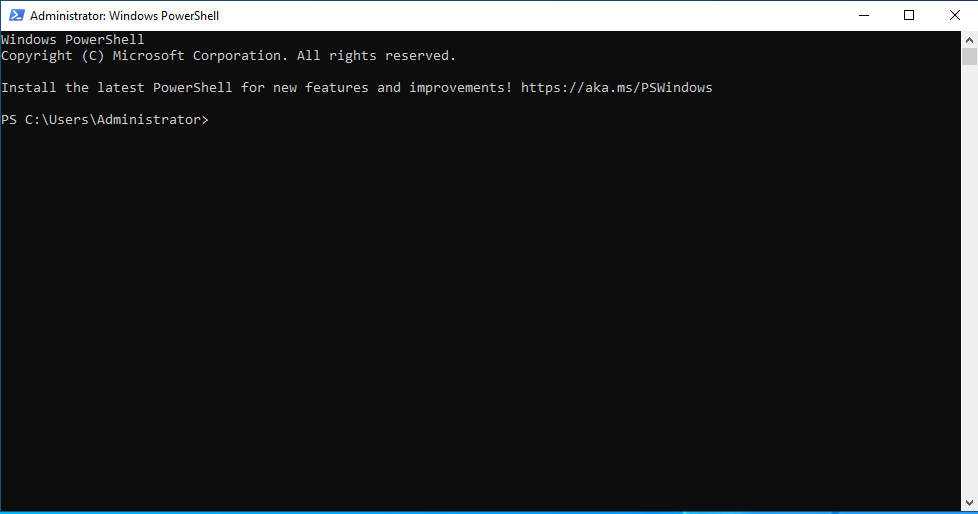

### Step :three:: Script Logic Implementation
**Action:** Implemented a `foreach` loop script designed to parse a `names.txt` file and generate standardized Active Directory user objects.
* **Evidence:** 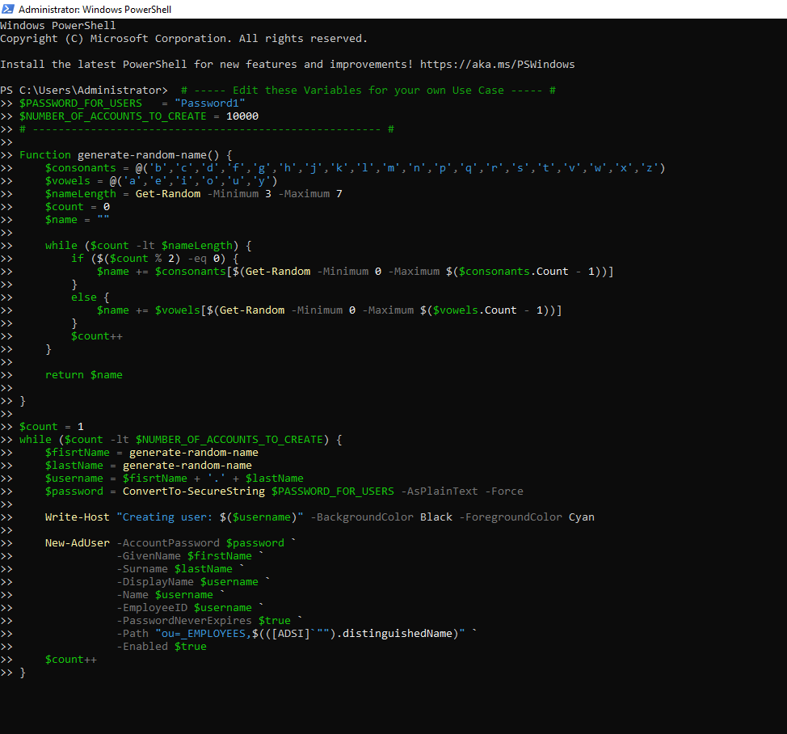

### Step :four:: Automation Persistence
**Action:** Saved the automation logic as a reusable `.ps1` script for future deployment and auditing.
* **Evidence:** 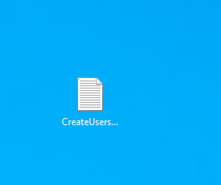

### Step :five:: Data Integration Verification
**Action:** Verified that the `names.txt` source file was correctly mapped to the script's input variables to ensure accurate data ingestion.
* **Evidence:** 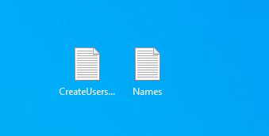

### Step :six:: Live Execution (Bulk Creation)
**Action:** Executed the script. The console reflects the real-time creation of thousands of accounts within the domain environment.
* **Evidence:** 

### Step :seven:: Final Active Directory Audit
**Action:** Performed a manual verification within "Active Directory Users and Computers" to confirm the successful creation of all objects within the **_EMPLOYEES** Organizational Unit (OU).
* **Evidence:**

  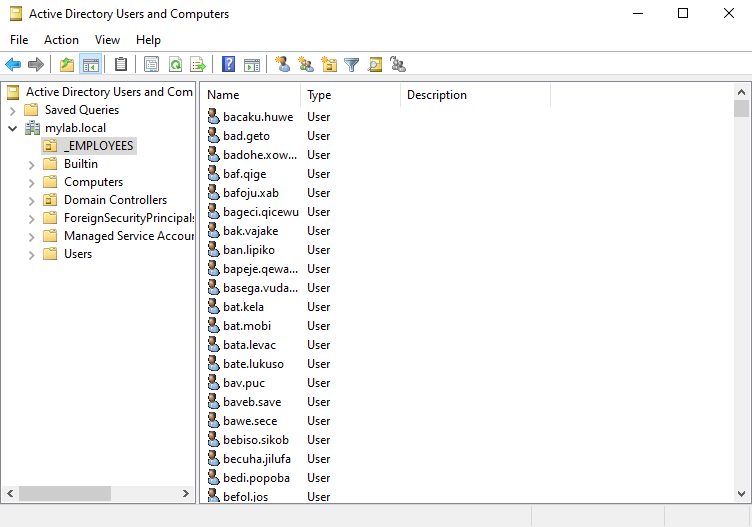
---

## Phase 3: Active Directory Configuration & Domain Integration
In this phase, I transformed the standalone server into a central management hub by implementing security policies, automating massive user growth, and integrating a workstation into the domain.

### Step :one:: DHCP Role Installation
**Action:** Installed the DHCP Server role on DC01 to enable automatic IP address assignment for client machines.
* **Evidence:**

  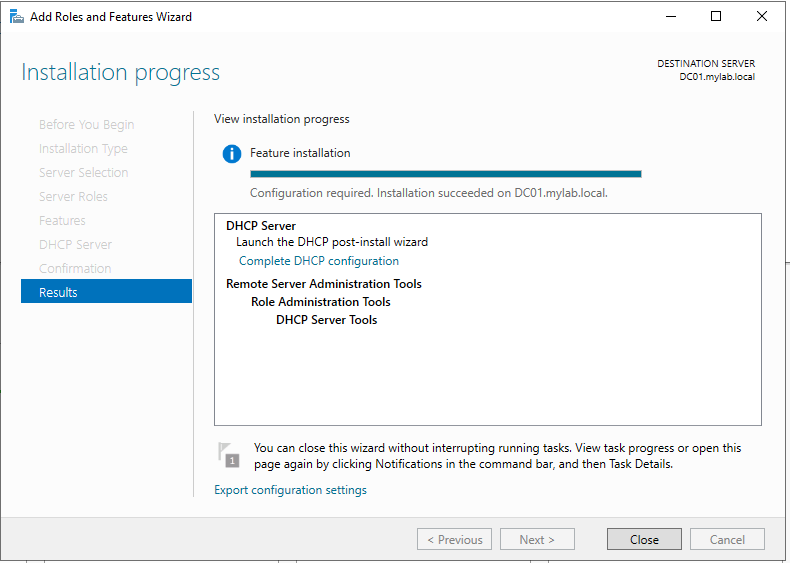

### Step :two:: DHCP Authorization
**Action:** Authorized the DHCP server in Active Directory to allow it to begin servicing client requests.
* **Evidence:**
  

### Step :three:: DHCP Scope Configuration
**Action:** Created and activated a DHCP scope (172.16.0.100-200) to assign IP addresses to Windows 10 clients.
* **Evidence:**
  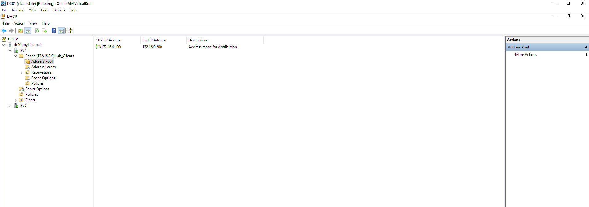

### Step :four:: Automation & "Big Data" Management
**Action:** Using a PowerShell script and a names.txt file, I automated the creation of **5,000 users**.
* **The Display Limit:** Documented the AD safety limit, which defaults to 2,000 objects.
* **Evidence:**
  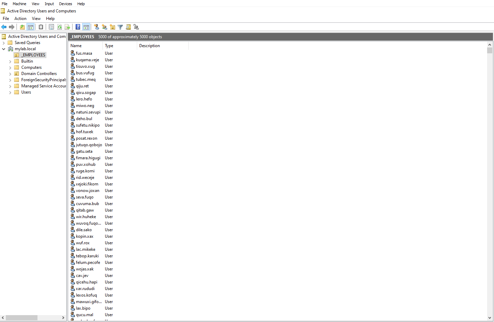

### Step :five:: Critical Troubleshooting: Resolving the Duplicate IP Conflict
**Action:** Identified and resolved a network connectivity failure between the Windows 10 workstation and DC01.
* **Investigation:** Executed `ipconfig /all` on the client, revealing that the manually assigned address `172.16.0.1` was flagged as a **(Duplicate)**.
* **Root Cause:** A conflict was identified because `172.16.0.1` was already statically assigned to the Domain Controller.
* **Resolution:** Reconfigured the workstation to a unique static IP (`172.16.0.2`), restoring full domain communication.
* **Evidence:**


  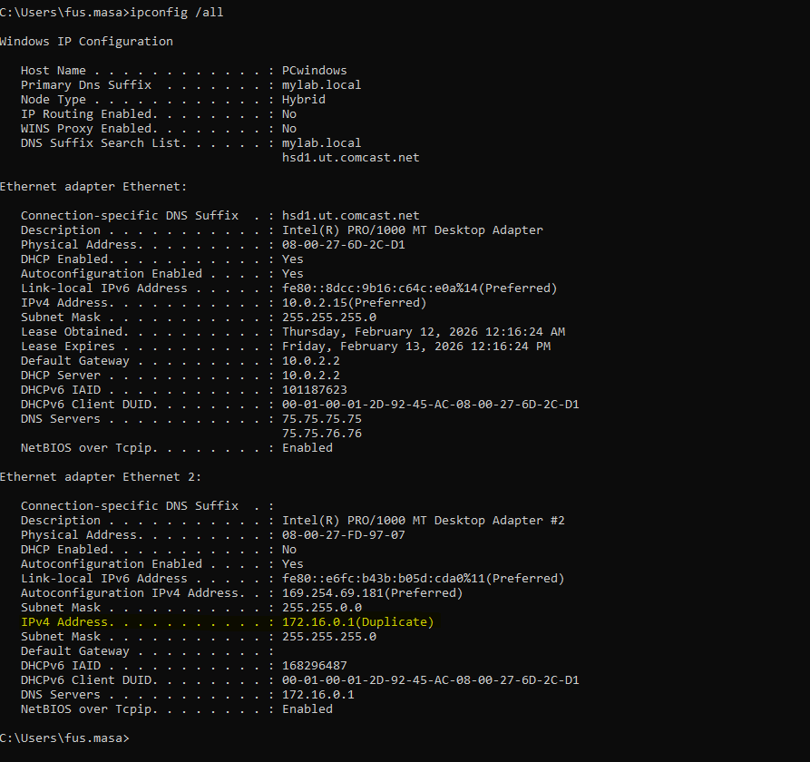

### Step :six:: Security Hardening (Group Policy)
**Action:** Enforced an enterprise-grade security baseline, including a **12-character minimum password length**.
* **Policy Settings:** Enabled complexity requirements and enforced a 24-password history.
* **Evidence:**
  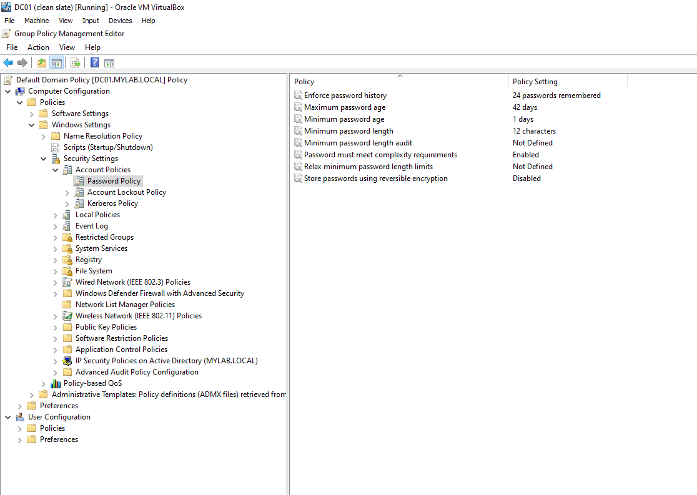

### Step :seven:: Domain Join & Verification
**Action:** Successfully joined the workstation to the `mylab.local` domain.
* **Evidence:**

  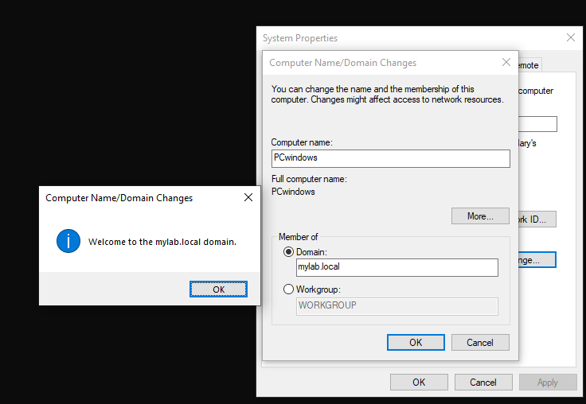

### Step :eight:: User Authentication Confirmation
**Action:** Logged in to the client as a domain user to confirm that DNS, DHCP, and AD are working in harmony.
* **Evidence:**
  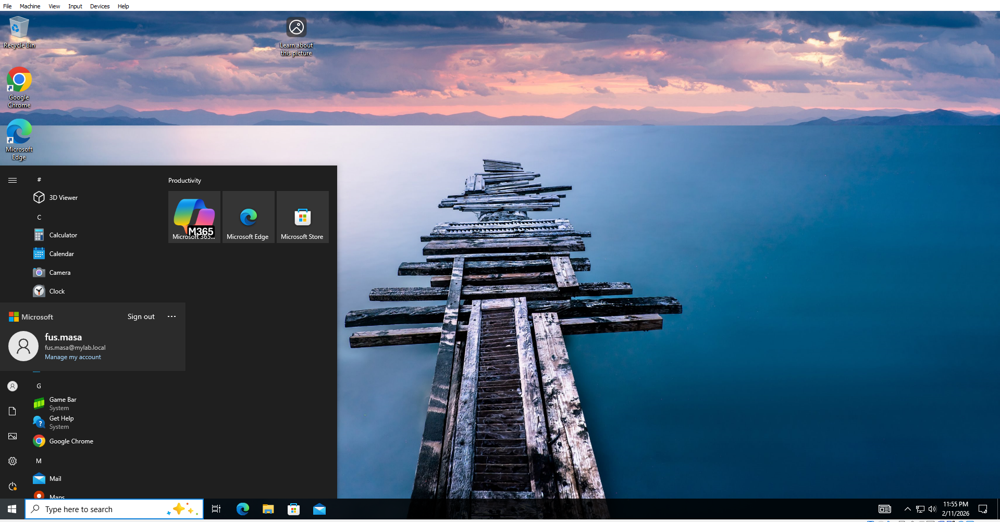

  ---

  
## 🚀 Outcomes & Results

* **Functional Domain Environment:** Successfully built a functional domain environment using a Windows Server 2022 Domain Controller.
* **Enterprise Service Configuration:** Deployed and validated core services including AD DS, DNS, and authorized DHCP scopes.
* **Scalability at Scale:** Demonstrated the ability to manage massive user growth by automating the creation of thousands of user accounts.
* **Security Hardening:** Implemented enterprise-grade security policies and password complexity requirements using Group Policy Objects.
* **Validated Connectivity:** Confirmed full domain functionality through successful workstation integration and domain user authentication.


---

## 🎓 Key Learnings & Skills Acquired

* **Directory Services Architecture:** Developed an understanding of enterprise-level directory services and domain hierarchy.
* **PowerShell Automation:** Gained proficiency in using PowerShell scripting for bulk administration and workflow automation.
* **Network Infrastructure Governance:** Mastered the configuration and management of critical network services like DHCP and DNS.
* **Security Policy Implementation:** Learned to enforce security baselines and account management policies using GPOs.
* **Technical Troubleshooting:** Successfully identified and resolved domain-specific issues, including IP conflicts and connectivity hurdles.
* **Identity & Access Management (IAM):** Applied industry best practices for managing user and computer accounts in an enterprise environment.

---

## 🗺️ Project Roadmap & Portfolio Navigation

### 📍 Current Phase: On-Premise Infrastructure (Complete)
This project serves as the foundation for enterprise identity management.

* **Step 1: On-Premise Foundation** (You are here)
* **Step 2: [Hybrid Cloud Bridge (Coming Soon)](#)** — Synchronizing this lab with Azure/Entra ID via Azure AD Connect.
* **Step 3: [Security Hardening & Monitoring (Planned)](#)** — Implementing advanced GPO security, Kerberos hardening, and gMSAs.

### 🎓 Portfolio Navigation
* **[ ⬅️ Previous Project: N/A ]**
* **[ ➡️ Next Project: Azure AD Hybrid Integration (In Progress) ](https://github.com/techboulnp-gif/Azure-Hybrid-Identity-Lab)**
---
**Created by:** Art Johnson | **Date:** 2026 | **Status:** 🟢 Complete

